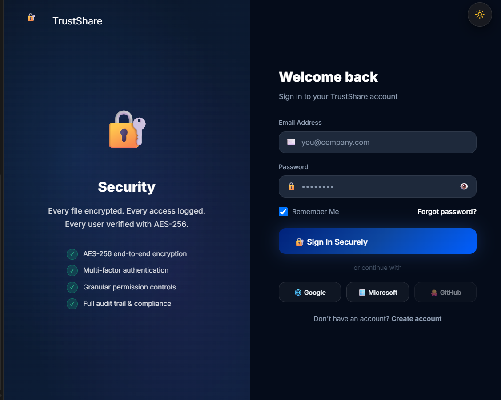
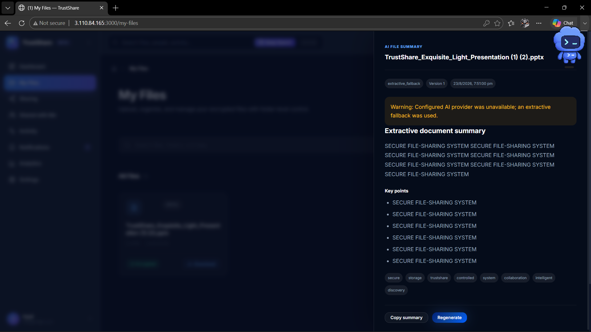

# TrustShare

Secure file sharing, encrypted storage, controlled collaboration, and audit-ready analytics in one full-stack application.

[](https://react.dev/)
[](https://fastapi.tiangolo.com/)
[](https://www.postgresql.org/)
[](https://www.docker.com/)

**Live demo:** [trustshare.13.61.15.139.nip.io](https://trustshare.13.61.15.139.nip.io/login)

> The hosted demo currently supports email/password authentication and Google OAuth. Microsoft authentication is intentionally hidden until an Entra application is configured.

## Screenshots

### Authentication

OAuth provider buttons are environment-dependent; the hosted deployment currently enables Google only.



### AI-assisted document summary



## About the project

TrustShare is a secure collaboration platform for uploading, encrypting, organizing, sharing, and auditing files. The React client provides a responsive user experience while the FastAPI service handles authentication, authorization, file encryption, sharing policies, analytics, and persistence in PostgreSQL.

The application supports both local storage and an optional S3-compatible storage configuration. AI summaries are optional: the backend can use a configured provider or an extractive fallback without sending documents to an external model.

## Features

- AES-256 encrypted file storage with per-file key handling and key rotation
- Email/password registration, email OTP verification, JWT sessions, and optional MFA
- Google OAuth 2.0 authentication
- Folders, file versioning, downloads, previews, and search
- Expiring or password-protected public links with permissions and view limits
- Direct sharing with other TrustShare users
- Activity logs, notifications, dashboards, and security/file analytics
- PDF and CSV analytics exports
- AI-assisted summaries for documents, spreadsheets, presentations, and PDFs
- Admin views for users, shares, security posture, and system activity
- Light and dark themes with responsive layouts

## Architecture

```text
Browser
  └── React 18 client (Nginx in Docker)
        └── /api/*
              └── FastAPI service
                    ├── PostgreSQL 16
                    ├── encrypted local storage or Amazon S3
                    ├── SMTP provider
                    └── optional AI summary provider
```

## Technology stack

| Layer | Technology |
|---|---|
| Frontend | React 18, React Router, Axios, Framer Motion, Chart.js/Recharts |
| Backend | Python 3.12, FastAPI, SQLAlchemy, Pydantic |
| Database | PostgreSQL 16 |
| Authentication | JWT, email OTP/MFA, Google OAuth via Authlib |
| Storage | Encrypted local filesystem; optional Amazon S3 |
| Infrastructure | Docker Compose, Nginx; production-ready for a TLS reverse proxy |
| Testing | Pytest, React Testing Library |

## Requirements

For the recommended Docker setup:

- Docker Desktop or Docker Engine with Compose v2
- At least 4 GB of available memory
- Ports `3000`, `8000`, and `5432` available

For manual development:

- Node.js 20+
- Python 3.12+
- PostgreSQL 16+

## Quick start with Docker

1. Clone the repository and enter the server directory:

   ```bash
   git clone https://github.com/Zayden369/trustshare-secure-file-sharing.git
   cd trustshare-secure-file-sharing/project-root/server
   ```

2. Create the backend environment file:

   ```bash
   cp .env.example .env
   ```

   PowerShell equivalent:

   ```powershell
   Copy-Item .env.example .env
   ```

3. Replace the required values in `.env`:

   ```env
   ENVIRONMENT=development
   SECRET_KEY=<long-random-value>
   MASTER_KEY_HEX=<exactly-64-hex-characters>
   FRONTEND_URL=http://localhost:3000
   ```

   Generate both secrets separately with:

   ```bash
   python -c "import secrets; print(secrets.token_hex(32))"
   ```

4. Build and start the stack:

   ```bash
   docker compose up --build
   ```

5. Open:

   - Application: <http://localhost:3000>
   - API documentation: <http://localhost:8000/docs>
   - API health check: <http://localhost:8000/health>

Stop the stack with `docker compose down`. Add `-v` only when you intentionally want to remove the PostgreSQL volume and all local application data.

## Manual development setup

### Backend

```bash
cd project-root/server
python -m venv .venv
```

Activate the environment:

```powershell
.venv\Scripts\Activate.ps1
```

```bash
source .venv/bin/activate
```

Then install and run:

```bash
pip install -r requirements.txt
cp .env.example .env
python -m src.main
```

The backend expects PostgreSQL at the `DATABASE_URL` configured in `.env`.

### Frontend

In a second terminal:

```bash
cd project-root/client
npm ci --legacy-peer-deps
cp .env.example .env
npm start
```

The development client runs at <http://localhost:3000> and calls the API URL specified by `REACT_APP_API_URL`.

## Configuration

Never commit `.env`, encryption keys, SMTP credentials, cloud credentials, or OAuth client secrets. The repository includes safe templates:

- `project-root/server/.env.example`
- `project-root/client/.env.example`

Important backend variables include:

| Variable | Purpose |
|---|---|
| `SECRET_KEY` | Signs authentication tokens |
| `MASTER_KEY_HEX` | Encrypts application file keys; must be 64 hexadecimal characters |
| `DATABASE_URL` | PostgreSQL SQLAlchemy connection string |
| `FRONTEND_URL` | Public client origin used in redirects and email links |
| `SMTP_*` | Email delivery for OTP and account notifications |
| `GOOGLE_CLIENT_ID` / `GOOGLE_CLIENT_SECRET` | Google OAuth web client credentials |
| `STORAGE_BACKEND` | `local` or `s3` |
| `AWS_*` | S3 configuration when S3 storage is enabled |
| `AI_SUMMARY_PROVIDER` | Optional AI summary provider |

### Google OAuth

Create a **Web application** OAuth client in Google Cloud and register:

```text
http://localhost:8000/api/auth/oauth/google/callback
```

Set the generated client ID and secret in `project-root/server/.env`. For production, replace `localhost:8000` with the public HTTPS origin.

### SMTP

Configure a real SMTP provider to deliver OTP and notification emails. Gmail requires an app password when two-step verification is enabled. Amazon SES SMTP credentials also work. Do not use an ordinary account password.

## Tests

Backend:

```bash
cd project-root/server
pip install -r requirements-dev.txt
pytest -q
```

Frontend:

```bash
cd project-root/client
npm ci --legacy-peer-deps
npm test -- --watchAll=false
```

Production build:

```bash
cd project-root/client
npm run build
```

## Repository structure

```text
project-root/
├── client/                 React application
│   ├── public/
│   └── src/
├── server/                 FastAPI application and Compose stack
│   ├── src/
│   ├── tests/
│   ├── Dockerfile
│   └── docker-compose.yml
└── docs/                   Architecture notes, module reports, and screenshots
```

## Security notes

- Treat `MASTER_KEY_HEX` as durable production data. Replacing it can make existing encrypted files unreadable.
- Use HTTPS in production and restrict CORS to known origins.
- Use unique PostgreSQL credentials outside local development.
- Store production secrets in a managed secret store rather than source control.
- Review storage retention and backup policies before handling sensitive files.

## API documentation

With the backend running, interactive OpenAPI documentation is available at `/docs`, with ReDoc at `/redoc`.

## License

No open-source license has been added yet. Unless a license is supplied, all rights remain with the repository owner.
